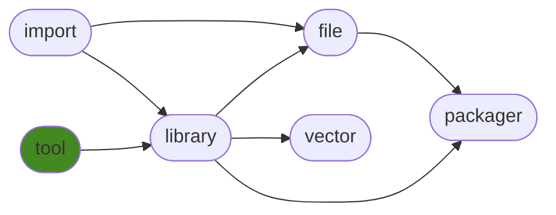

<h1>generaltool</h1>

Library code with no dependencies.

<h2>Table of Contents</h2>

<pre>
<a href='#generaltool'>generaltool</a>
├─ <a href='#Dependency-Diagram-for-ManderaGeneral'>Dependency Diagram for ManderaGeneral</a>
├─ <a href='#Installation-showing-dependencies'>Installation showing dependencies</a>
├─ <a href='#Information'>Information</a>
├─ <a href='#Attributes'>Attributes</a>
└─ <a href='#Contributions'>Contributions</a>
</pre>

<h2>Dependency Diagram for ManderaGeneral</h2>

<h2>Installation showing dependencies</h2>

| `pip install`     | `generaltool`   |
|:------------------|:----------------|
| *No dependencies* | ✔️              |

<h2>Information</h2>

| Package                                                      | Ver                                            | Latest Release       | Python                                                                                                                                                                                                                                                 | Platform        | Cover   |
|:-------------------------------------------------------------|:-----------------------------------------------|:---------------------|:-------------------------------------------------------------------------------------------------------------------------------------------------------------------------------------------------------------------------------------------------------|:----------------|:--------|
| [generaltool](https://github.com/ManderaGeneral/generaltool) | [0.1.0](https://pypi.org/project/generaltool/) | 2023-02-02 13:29 CET | [3.8](https://www.python.org/downloads/release/python-380/), [3.9](https://www.python.org/downloads/release/python-390/), [3.10](https://www.python.org/downloads/release/python-3100/), [3.11](https://www.python.org/downloads/release/python-3110/) | Windows, Ubuntu | 99.1 %  |

<h2>Attributes</h2>

<pre>
<a href='https://github.com/ManderaGeneral/generaltool/blob/master/generaltool/__init__.py#L1'>Module: generaltool</a>
└─ <a href='https://github.com/ManderaGeneral/generaltool/blob/master/generaltool/enforce_literal.py#L23'>Function: enforce_literals</a>
</pre>

<h2>Contributions</h2>

Issue-creation, discussions and pull requests are most welcome!

Generated 2023-02-02 13:29 CET for commit <a href='https://github.com/ManderaGeneral/generaltool/commit/master'>master</a>.

